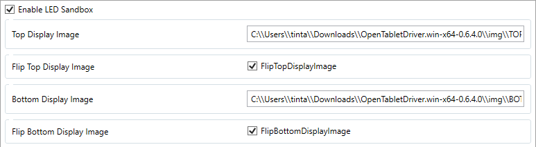

# OTD.LEDSandbox

This plugin allow users to use images of 64x128 resolution and show them on any of the 2 LED display contained within some Wacom tablets.

## Supported Tablets

- Wacom PTK-440
- Wacom PTK-540WL
- Wacom PTK-640
- Wacom PTK-840
- Wacom PTK-1240

## Installation

1. Head to the release page for the [latest version of the plugin.](https://github.com/Mrcubix/OTD.LEDSandbox/releases/latest)

2. Download either the x86 variant if you're using an x86 based system (x64 & x86), or arm if you're using an arm based system (32 & 64 bit),

3. Open the plugin manager in OpenTabletDriver,

4. Drag and drop the downloaded .zip file into the plugin manager,

## How to use

1. Open the filter tab in OpenTabletDriver,

2. Click on `LED Sandbox`,

3. Enable the filter,

4. Paste the path you want to display in either of the input boxes,

5. Flip the image if needed,

6. Click on `Apply`,